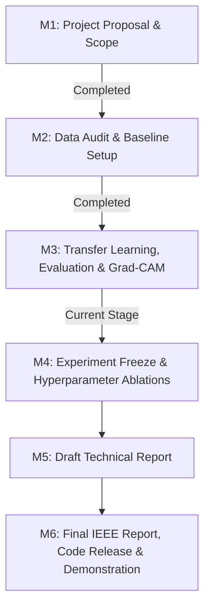

# Melanoma Skin Cancer Detection & Explainable AI (Grad-CAM)

> **CO5430 / CO543 Computer Vision Project · Medical Imaging Track**  
> **Department of Computer Engineering · University of Peradeniya**  
> **Group 15 (E/22)**  
> **Supervisor:** Dr. Upul Jayasinghe

---

## Project Overview

Melanoma is the deadliest form of skin cancer, responsible for over 75% of skin cancer-related fatalities despite accounting for less than 5% of all skin cancer diagnoses. Early and accurate detection significantly improves patient 5-year survival rates (exceeding 98% when caught in localized stages). 

This project develops an end-to-end deep learning system for the automated binary classification of dermoscopic skin lesions into **Benign** and **Malignant (Melanoma)**. Beyond raw predictive accuracy, this work places primary emphasis on **clinical safety metrics (Sensitivity/Recall and Specificity)** and **Explainable AI (XAI)** using **Gradient-weighted Class Activation Mapping (Grad-CAM)** to localize and interpret the visual lesion patterns driving network decisions.

---

## Team & Department

| Registration No. | Student Name | Email |
| :---: | :--- | :--- |
| **E/22/052** | K. H. D. M. Bimsara | `e22052@eng.pdn.ac.lk` |
| **E/22/058** | M. M. T. Cooray | `e22058@eng.pdn.ac.lk` |
| **E/22/353** | G. K. G. Sandeepa | `e22353@eng.pdn.ac.lk` |
| **E/22/419** | R. G. S. T. Weerasekara | `e22419@eng.pdn.ac.lk` |

* **Project Repository:** [https://github.com/cepdnaclk/e22-co5430-melanoma-cancer-detection](https://github.com/cepdnaclk/e22-co5430-melanoma-cancer-detection)
* **Kaggle Notebook:** [https://cepdnaclk.github.io/e22-co5430-melanoma-cancer-detection/](https://www.kaggle.com/code/gayashasandeepa/co5430-melanoma-cancer-detection)

---

## Implementation Plan & Milestone Progress



### Milestone Progress Status

| Milestone | Target Date | Status | Key Deliverables & Artifacts |
| :--- | :---: | :---: | :--- |
| **M0: Group formation and topic registration** | 7 Jul | **Done** | Group members, topic category, dataset source, preliminary GitHub link |
| **M1: Proposal and project plan** | 14 Jul | **Done** | Proposal document (`docs/documentation/CO5430_Project_Proposal.pdf`) defining problem scope and dataset selection. |
| **M2: Dataset and baseline checkpoint** | 28 Jul | **Done** | Initial repository layout, dataset verification, and presentation deck (`Group15_M2.pdf`). |
| **M3: Prototype and preliminary results checkpoint** | 18 Aug | **Completed** | Full experimental comparison (Baseline CNN from scratch, ResNet-18 (FE & FT), EfficientNet-B0, full test metrics table, error analysis, and 4-group Grad-CAM saliency heatmaps) and results presentation (`Group15_M2.pdf`)|
| **M4: Experiment Freeze** | 25 Aug | **Upcoming** | Hyperparameter freeze, finalizing checkpoint weights, and final quantitative tables. |
| **M5: Draft Report** | 01 Sep | **Upcoming** | Complete IEEE-formatted draft report with figures, methodology, and medical discussion. |
| **M6: Final Submission & Demo** | 07 Sep | **Upcoming** | Final IEEE manuscript, clean modular source package, and final presentation. |

---

## Dataset Overview & Preprocessing

The project utilizes the [Melanoma Cancer Dataset](https://www.kaggle.com/datasets/bhaveshmittal/melanoma-cancer-dataset) from Kaggle:

| Dataset Property | Details |
| :--- | :--- |
| **Total Images** | **13,879** dermoscopic images (224 × 224 RGB, 3 channels) |
| **Class Distribution** | Near-balanced: **7,289 Benign** (52.5%) vs. **6,590 Malignant** (47.5%) |
| **Partitioning** | **Train:** 10,691 images (90% training) · **Validation:** 1,188 images (10% carve-out) · **Test:** 2,000 images (held-out) |
| **Dataset Normalization** | $\mu_{\text{RGB}} = [0.7635, 0.5461, 0.5704], \quad \sigma_{\text{RGB}} = [0.1409, 0.1519, 0.1695]$ |
| **Augmentation Pipeline** | Random horizontal flip ($p=0.5$), vertical flip ($p=0.2$), random rotation ($\pm 15^\circ$), and color jitter (brightness, contrast, saturation). |

---

## Model Architectures & Methodologies

1. **Baseline CNN (Trained from Scratch):**
   - 3 consecutive `ConvBlock` layers (Conv2d $3\times3$ $\rightarrow$ BatchNorm $\rightarrow$ ReLU $\rightarrow$ MaxPool2d $2\times2$) with channel depths 32, 64, 128.
   - Global Average Pooling (GAP) $\rightarrow$ Dropout ($p=0.4$) $\rightarrow$ Dense (128 $\rightarrow$ 64) $\rightarrow$ Single binary logit.
   - Total Parameters: **~94,337** (empirical baseline).
2. **ResNet-18 (Feature Extraction):**
   - Pretrained ImageNet-1k backbone completely frozen; custom Dropout ($p=0.3$) + Linear ($512 \rightarrow 1$) classifier trained at $\eta = 10^{-3}$.
3. **ResNet-18 (Fine-Tuning):**
   - Deep residual blocks (`layer3` and `layer4`) plus classifier head unfrozen and fine-tuned at $\eta = 3 \times 10^{-4}$ with cosine annealing scheduler.
4. **EfficientNet-B0 (Compound Scaling):**
   - Pretrained MBConv backbone with compound depth/width scaling; final feature blocks (`features[7..8]`) and classifier ($1280 \rightarrow 1$) fine-tuned.

---

## Experimental Results & Comparative Ablation

Evaluated on the **2,000 held-out test images** (1,000 Benign vs. 1,000 Malignant):

| Model | Strategy | Parameters | Accuracy | Precision | Sensitivity / Recall | Specificity | F1-Score | ROC-AUC | PR-AUC |
| :--- | :--- | :---: | :---: | :---: | :---: | :---: | :---: | :---: | :---: |
| **Baseline CNN** | Scratch | ~94 K | 86.00% | 0.9000 | 0.8100 | 0.9100 | 0.8526 | 0.9446 | 0.9350 |
| **ResNet-18 (Feat. Ext.)** | Frozen | ~513 | 88.40% | 0.8887 | 0.8780 | 0.8900 | 0.8833 | 0.9494 | 0.9460 |
| **EfficientNet-B0** | Fine-Tuned | ~4.0 M | 93.95% | 0.9554 | 0.9220 | **0.9570** | 0.9384 | 0.9850 | 0.9845 |
| **ResNet-18 (Fine-Tuned)** | Fine-Tuned | ~4.7 M | **95.00%** | **0.9564** | **0.9430** | **0.9570** | **0.9496** | **0.9882** | **0.9877** |

---

## Visual Results & Explainability (Grad-CAM)

All high-resolution evaluation figures are stored in [`results/figures/`](results/figures/):

* **Comparative Metrics Heatmap:** [`results/figures/comparison_table_heatmap.png`](results/figures/comparison_table_heatmap.png)
* **Side-by-Side Confusion Matrices:** [`results/figures/side_by_side_confusion_matrices.png`](results/figures/side_by_side_confusion_matrices.png)
* **ROC & Precision-Recall Curves:** [`results/figures/roc_and_pr_curves_comparison.png`](results/figures/roc_and_pr_curves_comparison.png)
* **ResNet-18 Grad-CAM Saliency Grid:** [`results/figures/gradcam_resnet18_fine_tuned.png`](results/figures/gradcam_resnet18_fine_tuned.png)
* **Scratch vs. Pretrained Interpretability:** [`results/figures/gradcam_baseline_vs_resnet18_comparison.png`](results/figures/gradcam_baseline_vs_resnet18_comparison.png)
* **Diagnostic Misclassification Inspection:** [`results/figures/misclassified_false_positives.png`](results/figures/misclassified_false_positives.png) & [`results/figures/misclassified_false_negatives.png`](results/figures/misclassified_false_negatives.png)

---

## Repository Structure

```
e22-co5430-melanoma-cancer-detection/
├── notebooks/
│   ├── co5430-melanoma-cancer-detection.ipynb  ← Master Unified End-to-End Notebook (Kaggle/Colab)
│   └── CO5430_melanoma_pipeline.ipynb          ← Baseline demonstration notebook
├── results/
│   ├── metrics.json                             ← Machine-readable test evaluation metrics
│   ├── README.md                                ← Detailed results documentation
│   └── figures/                                 ← High-resolution plots, ROC curves & Grad-CAM heatmaps
├── src/                                         ← Clean modular Python codebase (Phase B)
│   ├── dataset.py                               ← Dataset loaders, path auto-detection & transforms
│   ├── models.py                                ← BaselineCNN, ResNet18Model, EfficientB0 definitions
│   ├── train.py                                 ← Standardized training loop with early stopping
│   ├── evaluate.py                              ← Clinical metrics calculation & figure generation
│   ├── gradcam.py                               ← Hook-based Grad-CAM saliency mapping engine
│   └── predict.py                               ← Single-image CLI inference tool
├── docs/                                        ← Jekyll documentation website (GitHub Pages)
│   ├── _config.yml
│   ├── data/index.json                          ← Team metadata & supervisor details
│   ├── documentation/                           ← Project proposal, slides, assignment specs
│   └── README.md                                ← Website homepage source
├── requirements.txt                             ← Python environment dependencies
└── README.md                                    ← Project homepage
```

---

## Quick Start Guide

### Running on Kaggle (Recommended)
1. Open Kaggle and create a new notebook via `File -> Import Notebook`.
2. Upload [`notebooks/co5430-melanoma-cancer-detection.ipynb`](notebooks/co5430-melanoma-cancer-detection.ipynb).
3. In the right-hand panel:
   - Attach dataset: Click **`+ Add Input`** and search for `bhaveshmittal/melanoma-cancer-dataset`.
   - Enable GPU: Set **`Accelerator`** to **`GPU T4 x2`**.
   - Enable Internet: Set **`Internet`** to **`ON`** (to download ImageNet pretrained weights).
4. Click **`Run All`**. All training logs, confusion matrices, ROC curves, and Grad-CAM grids will display inline and save to `/kaggle/working/`.

<!-- ### Running Locally
```bash
# 1. Clone repository
git clone https://github.com/cepdnaclk/e22-co5430-melanoma-cancer-detection.git
cd e22-co5430-melanoma-cancer-detection

# 2. Install dependencies
pip install -r requirements.txt

# 3. Run CLI inference with Grad-CAM visualization
python src/predict.py --image path/to/lesion.jpg --model resnet18 --gradcam --output results/sample_cam.png
``` -->

---

## Medical Disclaimer

> **IMPORTANT:** This software system is developed strictly for **academic and research purposes** as part of the CO5430 Computer Vision curriculum. It is not an FDA/CE-cleared medical device and should **never** be used as a replacement for professional dermatological diagnosis, clinical biopsy, or medical consultations.

---

## License

Distributed under the **MIT License**. See `LICENSE` for more information.
